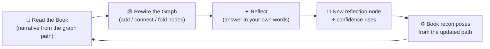
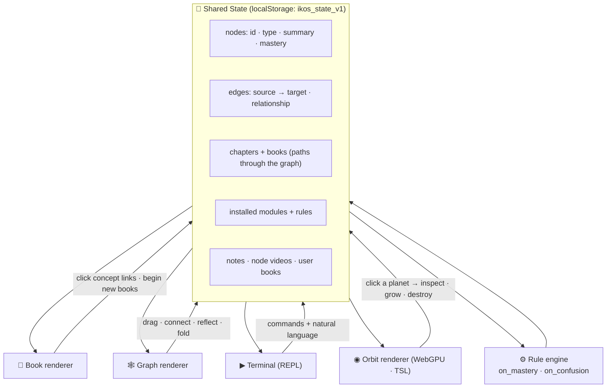
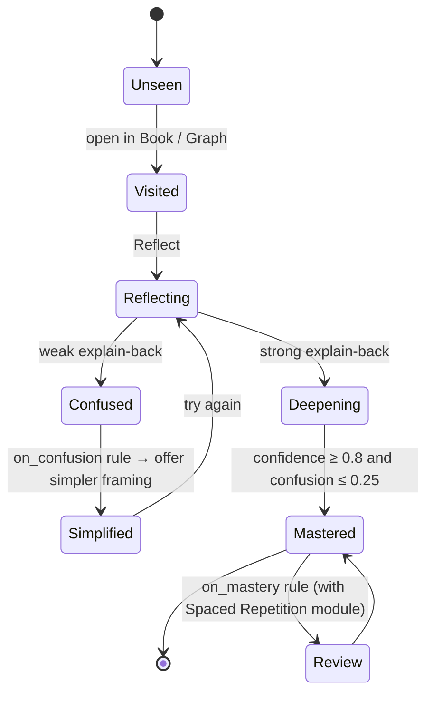
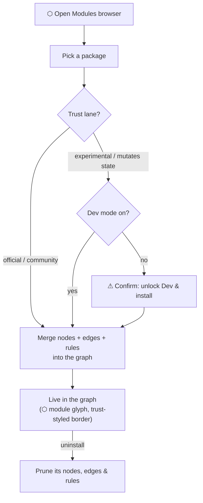

# Iterative Knowledge OS (IKOS)

> A knowledge-graph **runtime** where one shared state is rendered four ways — a **Book** you read, a **Graph** you rewire, a **Terminal** you command, and an **Orbit** you fly. Change any one and the others recompose, because they are the same living state.

IKOS treats understanding as something you *build and maintain*, not consume. Concepts are typed nodes; relationships are labeled edges; chapters are paths through the graph; books are shelves of chapters; and mastery is earned through reflection, not declared.

---

## Table of contents
- [What it is](#what-it-is)
- [The core loop](#the-core-loop)
- [Architecture](#architecture)
- [The four renderers](#the-four-renderers)
- [Books & chapters](#books--chapters)
- [Mastery model](#mastery-model)
- [Module ecosystem](#module-ecosystem)
- [Trust & safety](#trust--safety)
- [Voice, notes & video](#voice-notes--video)
- [Terminal commands](#terminal-commands)
- [Running locally](#running-locally)
- [Deploying](#deploying)
- [Project structure](#project-structure)

---

## What it is

IKOS is a single self-contained web app. Seed content is a Stoic sequence on turning **anger → virtue**, but the runtime is domain-agnostic — everything you see is generated from the graph, and **20 installable modules** extend it from cybersecurity to Bismarck to Bach.

- **One source of truth.** `nodes`, `edges`, `positions`, `chapters`, `books`, `notes`, and per-node `mastery` live in one state object. Every view reads from it and every action writes to it.
- **Reflection grows the graph.** Answering a reflection prompt spawns a new node, raises confidence, and re-renders the Book to absorb it.
- **The Book writes itself.** Chapter prose is *composed* from the graph — each concept's passage is followed by paragraphs woven from its actual edges and a practice note that reads your live mastery back to you.
- **Extensible.** Graph packages merge new nodes, edges, and live rules into your graph — including a **WebGPU-rendered 3D orbital view**.

---

## The core loop



Read → rewire → reflect → re-read. The loop is the product.

---

## Architecture

One state, many renderers. Nothing is duplicated between views.



Implemented as a single **Design Component** (`Iterative Knowledge OS.dc.html`): one `class Component` holds all state; `renderVals()` returns every template input; all render paths read the same fields.

---

## The four renderers

| Renderer | What it shows | You can… |
|---|---|---|
| **📖 Book** | A narrative spread composed live from the current chapter's path. Three voices: *stoic*, *plain*, *technical* (telemetry lines). Page-flip turns; single reading column in Split view. | Read, switch voice, click `[[concept]]` links, 🔊 have it read aloud, begin a **new book** at the last page |
| **🕸 Graph** | Draggable typed nodes, labeled edges, gold = chapter path, green ring = mastered. Pan/zoom canvas with −/+/⌂ controls; clickable minimap. | Drag to arrange, drag the **↝ handle** to connect, tap to inspect, **fold** clusters, reflect/assess |
| **▶ Terminal** | A REPL (`~`) that accepts commands *and* natural language. 🎙 dictation supported. | Drive every part of the state from the keyboard — or by voice |
| **◉ Orbit** | Concepts as spinning wireframe **planets** on typed shells, starfield behind, edges as arcs. Mastered planets and hubs grow **Saturn-like rings**, and each planet spawns **moons** (one per connection) on tilted orbits; **shooting-star comets** streak the backdrop. **WebGPU + TSL node materials** by default, triple-fallback to classic WebGL (badge + engine toggle in the camera menu). | Drag to rotate (with momentum), scroll to zoom, camera presets (front/top/tilt/wide), **click a planet to fly the camera _into_ it** → detail modal: summary, connected concepts, reflect, **grow/destroy**, attach video |

---

## Books & chapters

Chapters are generated **automatically — every 3 nodes form a chapter** (`rechapter [n]` re-chunks at a different size). Every **12 chapters closes a book** and opens the next volume — The Porch, The Simulator, Exploring the Universe, The War Games… — with themed rail headers and a ringed planet on the chapter face from Book II on.

At the last page: **“Begin a new book?”** Name any topic and IKOS opens a fresh volume with a cover concept and starter nodes, ready to grow.

---

## Mastery model

Mastery is a small state machine per node, moved by what you do — not a checkbox.



- **`assess` / explain-back** runs `evaluateUnderstanding` → deepens or simplifies the node.
- The **rule engine** fires `on_mastery` (suggest next, gold ring) and `on_confusion` (offer simplify, red ring), surfaced in graph seals, the Book margin, and the terminal ticker.
- The Book's practice paragraphs quote your live confidence back at you, per concept, in voice.

---

## Module ecosystem

Modules are graph **packages** — `{ nodes, edges, rules, trust, permissions }` — installed from the **⬡ Modules** browser. Installing merges a package into your live graph; uninstalling prunes exactly what it added. You can also **export your own reflections** as a portable `.json` module.



**20 bundled packages**, bridged into the Stoic core:

- **Practice & mind** — Stoic Practices ◆ · CBT Bridge ⬡ · Anger & the Brain ✦ · Spaced Repetition ✦ *(installs a live `on_mastery → schedule_review` rule)* · Learning Science ◆
- **Security** — Zero Trust ◆ · Threat Modeling ⬡ · Social Engineering Defense ✦ · Cryptography ✦ · AI Safety Levels ✦
- **History & civilization** — Roman Engineering ⬡ · Egyptian Pyramids ⬡ · World History ⬡ · Wars of German Unification ⬡
- **Art & science** — Art History ⬡ · Classical Music ⬡ · Stellar Astronomy ◆ · Orbital Mechanics ⬡ · Game Theory ⬡
- **Capabilities** — Orbital View (3D) ✦ *(unlocks the ◉ Orbit renderer)*

◆ official · ⬡ community · ✦ experimental (Dev-gated)

---

## Trust & safety

- **Safe / Dev is a sealed switch, not a toggle.** It changes *only* from the terminal: `mode dev` / `mode safe`. Safe mode refuses experimental or state-mutating installs.
- **AI guardrails.** Every AI-suggested node is quarantined as *pending* with a support panel — **Approve** promotes it, **Reject** deletes it. AI never silently enters your trusted graph.
- **`killswitch`.** One command forces Safe mode, rejects all pending AI, and disarms every installed module rule.
- **`reset`.** Wipes local state back to the seed graph. (Your ❧ notes deliberately survive.)

---

## Voice, notes & video

- **🔊 Read** — narrates the current page with the most natural voice your browser has (ranked: neural/premium → deep UK male), tuned slower and lower for stoic gravitas. Web Speech API, no keys.
- **🎙 Dictate** — the mic in the terminal turns speech into commands (`install "Game Theory"`, `reflect on anger`…). Chrome/Edge.
- **❧ Notes** — a drawer for your own writing. Each note is stamped with its context (selected node or current chapter) and the time; persistent, deletable, and kept through `reset`.
- **▶ Concept videos** — every planet's detail modal takes a YouTube/Vimeo/.mp4 URL — or **⚡ auto-find**, which races keyless search APIs for real video IDs and cues them as a playlist in the official YouTube IFrame player (play/pause/stop/⏭ next, auto-skips embed-blocked results).
- **⛶ Fullscreen** · **?** replayable guided tour · responsive down to phone widths.

---

## Terminal commands

Open with `~`. Accepts commands and natural language.

| Command | Effect |
|---|---|
| `help` | List commands |
| `add "Label"` · `connect "A" to "B"` | Create / link nodes |
| `iterate "X" depth N` | Generate AI sub-nodes (arrive as *pending*) |
| `modules` · `install "X"` · `uninstall "X"` · `export "Name"` | Module ecosystem |
| `rechapter [n]` | Re-chunk the graph into chapters of ~n nodes (auto: 3) |
| `mode dev` · `mode safe` | Change trust level (the only way) |
| `killswitch` | Lock down: Safe mode + reject pending AI + disarm rules |
| `reset` | Restore the seed graph (notes survive) |

---

## Running locally

No build step — it's a static site. Serve the folder with any static server:

```bash
npx serve .
# then open the printed URL (e.g. http://localhost:3000)
```

Or open `index.html` (the bundled standalone build) directly in a browser — double-clicking the
file works, though a static server avoids browser `file://` restrictions.

State persists to `localStorage` under `ikos_state_v1`. Type `reset` in the terminal for a clean seed.

---

## Deploying

The repo is Vercel-ready — `vercel.json` serves `index.html` at every route. Deploy with the
Vercel CLI, or connect the repo to Vercel's Git integration and push:

```bash
vercel deploy
```

`index.html` is a **bundled output, not hand-written** — it's generated from the DC source
(`Iterative Knowledge OS.dc.html`) by the `dc-runtime` toolchain (`bun run build`). Edit the DC
source, rebuild, then deploy. A lightweight in-repo regenerator is also included for source-only
edits, so you can ship without the full toolchain:

```bash
# after editing "Iterative Knowledge OS.dc.html" or support.js
node build.mjs      # regenerates index.html (the deploy artifact) from source
vercel deploy
```

`build.mjs` reproduces what the DC bundler does — swaps `./support.js` for its manifest asset,
transplants the injected self-hosted-font `<helmet>`, re-gzips `support.js`, and runs a
round-trip self-check. (Fonts are frozen; adding a new font family still needs a full `dc-runtime`
rebuild.) Either way, do not hand-edit `index.html`.

### Installable PWA

The deploy is an installable app — Chrome/Edge on Android or desktop offer **Install** from the
address bar (iOS: Share → Add to Home Screen), and it runs standalone and **fully offline**
(the service worker keeps the shell and the three.js CDN modules cached; navigations are
network-first, so new deploys land as soon as you're online). The pieces:

- `manifest.webmanifest` + `icons/` — identity and icons (regenerate with `npm run icons`,
  a dependency-free renderer of the gold orbital mark).
- `sw.js` — the service worker.
- `build.mjs` injects the manifest link and SW registration into the bundle shell (idempotent).

---

## Project structure

```
.
├── index.html                     # bundled standalone build (deploy target — generated)
├── Iterative Knowledge OS.dc.html # source Design Component (all state + renderers)
├── support.js                     # DC runtime
├── build.mjs                      # regenerates index.html from source (run before deploy)
├── manifest.webmanifest           # PWA identity (installable app)
├── sw.js                          # service worker — offline shell + CDN cache
├── icons/                         # PWA icons (generated: npm run icons)
├── scripts/                       # check-bundle.mjs · make-icons.mjs
├── vercel.json                    # static hosting config
├── TODO.md                        # roadmap & task checklist
└── README.md
```

> **Source of truth is `Iterative Knowledge OS.dc.html`.** `index.html` is a generated bundle —
> regenerate it with `node build.mjs` (or the full `dc-runtime` build) before deploying, rather
> than editing it directly.

See [TODO.md](TODO.md) for the roadmap — the tactical-command direction, scale/perf work, mobile, and IKOS ↔ EHR ↔ echoUniverse convergence.

---

## License

**None — all rights reserved.** Copyright © 2026 Zachary Neil Auerbach.

This is an experimental work made source-visible for reference only. No use, modification, deployment, or redistribution without written permission — see [COPYRIGHT](COPYRIGHT).
